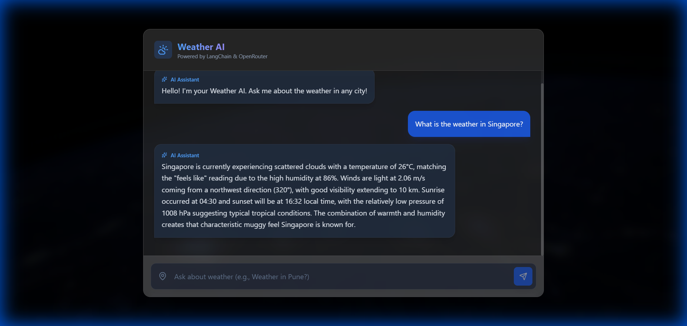
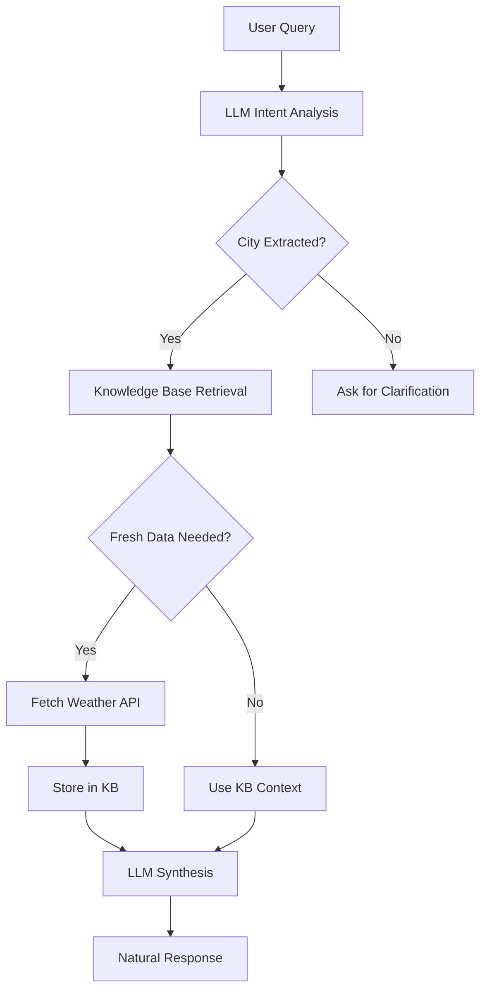

# Weather AI

## Advanced RAG System for Meteorological Intelligence



Weather AI is a production-grade Retrieval-Augmented Generation (RAG) platform designed to provide conversational meteorological insights. It leverages a sophisticated reasoning engine to synthesize real-time telemetry with historical context, providing a highly accurate and context-aware user experience.

The project is built with a focus on resource efficiency and democratized access, utilizing open-weights models and free-tier API integrations without compromising on professional standards or architectural integrity.

---

## Architecture Overview



The system follows a modular pipeline for data processing:

1. **Intent Extraction**: Logical analysis of the query to identify target location and information requirements.
2. **Context Retrieval**: Similarity search against the local vector database for historical insights.
3. **Telemetry Acquisition**: Real-time data retrieval from meteorological services.
4. **Insight Synthesis**: DeepSeek-driven generation of natural language responses, filtered for optimal clarity.

---

## Core Capabilities

### Reasoning Engine
The system utilizes the DeepSeek R1T2 Chimera model to perform complex intent analysis and response synthesis. Unlike traditional weather status bots, this engine can interpret subjective queries (e.g., "Is the weather suitable for outdoor events?") by analyzing multiple data points including visibility, pressure trends, and humidity.

### Retrieval-Augmented Generation (RAG)
By integrating ChromaDB for local vector storage, the system maintains a persistent knowledge base of meteorological insights. Each query is cross-referenced with historically retrieved data, ensuring that responses are grounded in consistent, contextually relevant information.

### Efficient Architecture
- **Large Language Model**: DeepSeek R1T2 Chimera (via OpenRouter)
- **Data Source**: OpenWeatherMap API
- **Vector Database**: ChromaDB (Local Persistent Storage)
- **Embeddings**: Sentence Transformers (Local Execution)

---

## Technical Stack

- **Frameworks**: FastAPI (Backend), React (Frontend)
- **Orchestration**: LangChain
- **Database**: ChromaDB
- **Styles**: Tailwind CSS
- **Models**: DeepSeek R1T2, all-MiniLM-L6-v2

---

## Getting Started

### Prerequisites
- Python 3.10 or higher
- Node.js (v18+)
- OpenRouter API Key
- OpenWeatherMap API Key

### Installation

1. **Backend Environment**
   ```bash
   cd backend
   python -m venv venv
   # Windows
   .\venv\Scripts\activate
   # Linux/macOS
   source venv/bin/activate
   pip install -r requirements.txt
   ```

2. **Frontend Environment**
   ```bash
   cd frontend
   npm install
   ```

3. **Configuration**
   Create a `.env` file in the `backend/` directory using `.env.example` as a template. Populate the required API keys.

### Running the Project

**Start Backend Server:**
```bash
cd backend
python -m uvicorn app.main:app --host 0.0.0.0 --port 8000 --reload
```

**Start Frontend Development Server:**
```bash
cd frontend
npm run dev
```

The application will be accessible at `http://localhost:5173`.

---

## Deployment

For professional deployment strategies including Vercel integration, please refer to the [Deployment Guide](DEPLOYMENT_GUIDE.md).

## License

This project is released under the MIT License.
